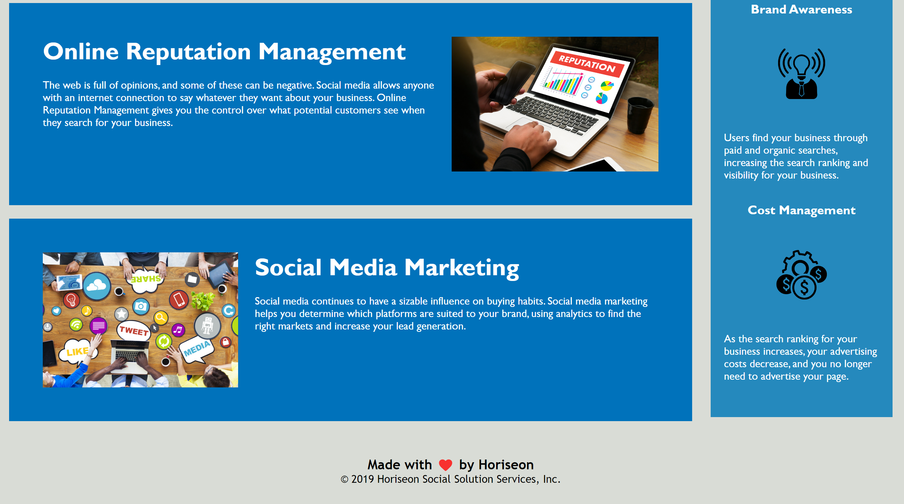

# Challenge 01 - Code Refractor - Horiseon

## Table of Contents

* [Description](#description)
* [Usage](#usage)
* [Credits](#credits)
* [License](#license)

## Description 

### User Story

```
AS A marketing agency ensuring all people, including users with disabilities, are able to access our website is highly important to our brand
I WANT a codebase that follows accessibility standards, allowing users access our website easily with assistive technologies such as video captions, screen readers, and braille keyboards
SO THAT our own site is optimized for search engines such as google.
```

### Acceptance Criteria

```
* Semantic HTML elements found throughout the original source code are inserted
* HTML elements follow a logical structure independent of styling and positioning
* Image and icon elements contain accessible `alt` attributes
* Heading attributes fall in sequential order
* Title elements contain a concise, descriptive title
* Application deployed at live URL
* Deployed application implements code improvements
```

### Deployed Application

* The URL of the deployed application:
```
``` 

* The URL of the GitHub repository: 
```
```

## Usage 

Explore the Horiseon site using the navigation bar (as shown below)


Also, find below images showing the current view of top, mid and bottom of the page




## Credits

* [Read up on Semantic HTML](https://www.w3schools.com/html/html5_semantic_elements.asp)
* [Read up on Image `alt` attributes](https://www.w3schools.com/tags/att_img_alt.asp)
* [Learn how to enable github pages](https://www.youtube.com/watch?v=P4Mu1t5rIXg&ab_channel=DanielSullivan)
* [Master basic markdown syntax](https://docs.github.com/en/get-started/writing-on-github/getting-started-with-writing-and-formatting-on-github/basic-writing-and-formatting-syntax)
* [Choosing an open source licence](https://choosealicense.com/)

## License

Licensed under the [MIT](https://choosealicense.com/licenses/mit/) license
